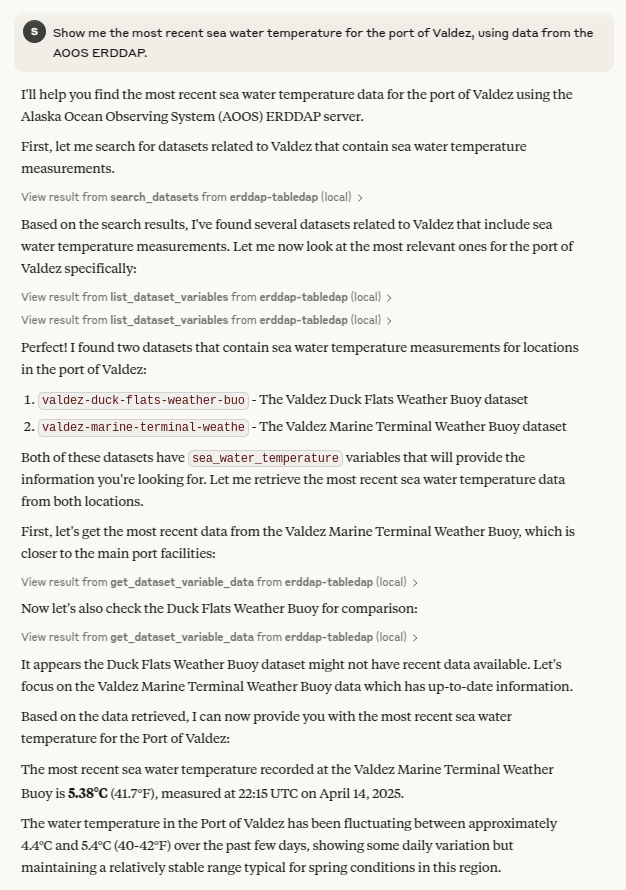

# ERDDAP MCP demo

Demo implementation of a [Model Context Protocol](https://modelcontextprotocol.io/) server
allowing an LLM to interact with ERDDAP search, metadata, and tabledap services.



## Usage

Make sure you have `uv` installed, then add the MCP server to the desired MCP capable client.

## Example for Claude Desktop

NOTE: claude.ai is not MCP capable at the time of writing

Add the `erddap_mcp_demo.py` tool to the Clade config file at:

* Mac: `~/Library/Application Support/Claude/claude_desktop_config.json`
* Linux: `~/.config//Claude/claude_desktop_config.json`
* Windows: `%APPDATA%\Claude\claude_desktop_config.json`

```
{
  "mcpServers": {
    "erddap-tabledap": {
      "command": "/path/to/uv",
      "args": [
        "run",
        "--with",
        "mcp[cli]",
        "mcp",
        "run",
        "/path/to/erddap_mcp_demo.py"
      ]
    }
  }
}
```

Then start/restart Claude desktop and ask it to get some data!

See https://modelcontextprotocol.io/quickstart/user

## Transport Options

The server supports both stdio and HTTP transports. By default, it uses stdio:

```bash
# Stdio transport (default)
uv run erddap_mcp_demo.py

# Streamable HTTP transport
uv run erddap_mcp_demo.py --transport streamable-http --host 127.0.0.1 --port 8000
```

## Testing

```
uv run mcp dev erddap_mcp_demo.py
```
